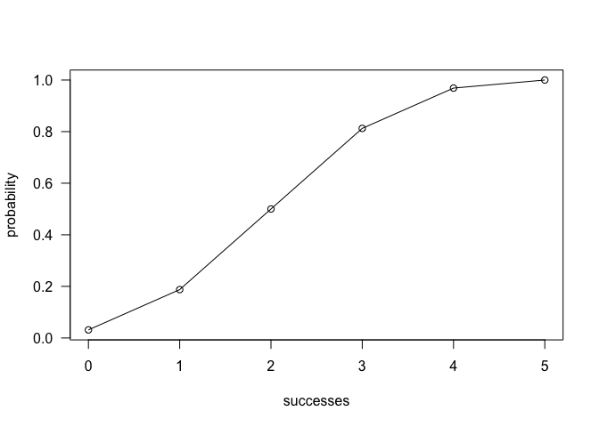

Workout3
================
Zhe Chen

Overview
--------

"binomal" is a minimal R package that provides functions to calculate probabilities of a Binomial random variable, and related calculations such as the probability distribution, the expected value, variance.

Installation
------------

Install the development version from GitHub via the package "devtools":

``` r
# development version from GitHub:
#install.packages("devtools") 

# install "cointoss" (without vignettes)
#devtools::install_github("stat133-sp19/hw-stat133-Zhe-Chen-karen/binomial")

# install "cointoss" (with vignettes)
#devtools::install_github("stat133-sp19/hw-stat133-Zhe-Chen-karen", build_vignettes = TRUE)
```

Main functions
--------------

-   bin\_mean(): compute the mean of a binomail distribution
-   bin\_variance(): compute the varince of a binomail distribution
-   bin\_mode(): compute the mode of a binomail distribution
-   bin\_skewness(): compute the skewness of a binomail distribution
-   bin\_kurtosis(): compute the kurtosis of a binomail distribution
-   bin\_choose(): compute the number of combinations in which k successes can occur in n trials
-   bin\_probability(): compute the probability of getting k successes in n trials with specific probability of success.
-   bin\_distribution(): returns a data frame with the probability distribution
-   bin\_cumnulative(): returns a data frame with both the probability distribution and the cumulative probabilities
-   bin\_variable(): returns an object of class "binvar", that is, a binomial random variable object
-   plot.bincum(): graphs the cumulative distribution of an object "bincum"
-   plot.bindis(): graphs a barplot to display the probability histogram of a binomial distribution object bindis
-   summary.binvar(): shows a full summary description of the object binvar

Usage
-----

``` r
library(binomial)
#functions of measure
bin_mean(10, 0.3)
#> [1] 3
bin_variance(10, 0.3)
#> [1] 2.1
bin_mode(10, 0.3)
#> [1] 3
bin_skewness(10, 0.3)
#> [1] 0.2760262
bin_kurtosis(10, 0.3)
#> [1] -0.1238095

#compute the number of combinations in which k successes can occur in n trials
bin_choose(n = 5, k = 3)
#> [1] 10

#compute the probability of getting k successes in n trials with specific probability of success
bin_probability(success = 3, trials = 10, prob = 0.3)
#> [1] 0.2668279

#show probability distribution
bin_distribution(trials = 5, prob = 0.5)
#>   success probability
#> 1       0     0.03125
#> 2       1     0.15625
#> 3       2     0.31250
#> 4       3     0.31250
#> 5       4     0.15625
#> 6       5     0.03125
dis1 <- bin_distribution(trials = 5, prob = 0.5)
plot(dis1)
```


``` r

#show the cumulative probabilities
bin_cumulative(trials = 5, prob = 0.5)
#>   success probability cumulative
#> 1       0     0.03125    0.03125
#> 2       1     0.15625    0.18750
#> 3       2     0.31250    0.50000
#> 4       3     0.31250    0.81250
#> 5       4     0.15625    0.96875
#> 6       5     0.03125    1.00000
dis2 <- bin_cumulative(trials = 5, prob = 0.5)
plot(dis2)
```



``` r

#generate a binomial random variable object
bin1 <- bin_variable(trials = 10, p = 0.3)
bin1
#> "Binomial variable"
#> 
#> Paramaters
#> - number of trials:  10 
#> - prob of success:  0.3

#summary
summary(bin1)
#> "Summary Binomial"
#> 
#> Paramaters
#> - number of trials:  10 
#> - prob of success:  0.3 
#> 
#> Measures
#> - mean    :  3 
#> - variance:  2.1 
#> - mode    :  3 
#> - skewness:  0.2760262 
#> - kurtosis:  -0.1238095
```
