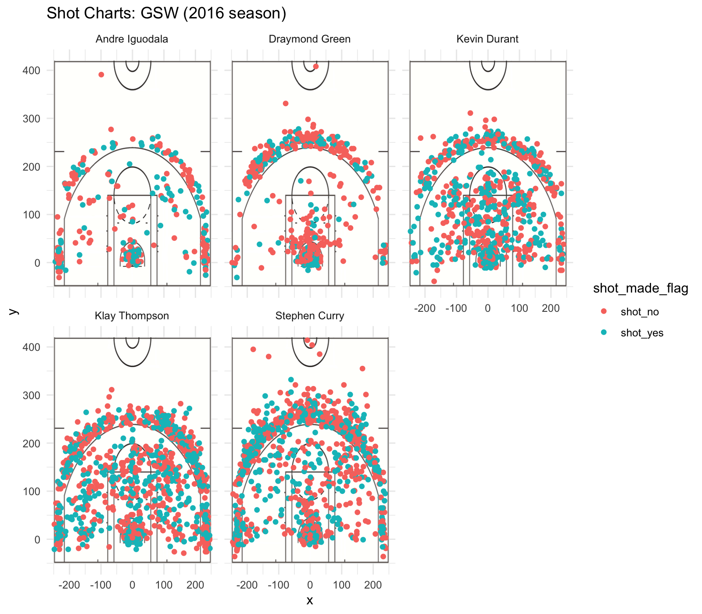

Workout 1
================
Zhe Chen

Specialization and Cooperation of the Golden State Warriors' Players
====================================================================

Introduction
------------

When it comes to one of the best teams in NBA history, most of us think immediately of the Golden State Warriors. It is no exaggeration to say that, this brilliant basketball team has worked wonders with impressive field goal percentages. While marvelling at the achievements of Golden State Warriors, one cannot help wondering: what are the determinant factors of its success? In fact, it is of great significance to win the basketball game by building a team with skillful players and rational division of work. The main contents of this report are to explore how the players of Golden State Warriors make the general deployment in respect of division of work and cooperation.

data
----

To analyze the teamwork of the Golden State Warriors, we look at the shots data of five star players during the 2016 season. Firstly, we create three tables to summarize the effective shooting percentages by player. The following tables display the 2 ponits, 3 points and overall field goal effective shooting percentage in descending order respectively.

    Attaching package: 'dplyr'

    The following objects are masked from 'package:stats':

        filter, lag

    The following objects are masked from 'package:base':

        intersect, setdiff, setequal, union

| name           |  total|  made|  perc\_made|
|:---------------|------:|-----:|-----------:|
| Andre Iguodala |    210|   134|   0.6380952|
| Kevin Durant   |    643|   390|   0.6065319|
| Stephen Curry  |    563|   304|   0.5399645|
| Klay Thompson  |    640|   329|   0.5140625|
| Draymond Green |    346|   171|   0.4942197|

| name           |  total|  made|  perc\_made|
|:---------------|------:|-----:|-----------:|
| Klay Thompson  |    580|   246|   0.4241379|
| Stephen Curry  |    687|   280|   0.4075691|
| Kevin Durant   |    272|   105|   0.3860294|
| Andre Iguodala |    161|    58|   0.3602484|
| Draymond Green |    232|    74|   0.3189655|

| name           |  total|  made|  perc\_made|
|:---------------|------:|-----:|-----------:|
| Kevin Durant   |    915|   495|   0.5409836|
| Andre Iguodala |    371|   192|   0.5175202|
| Klay Thompson  |   1220|   575|   0.4713115|
| Stephen Curry  |   1250|   584|   0.4672000|
| Draymond Green |    578|   245|   0.4238754|

Discussion
----------

From above tables, we can see that there is a difference performance of the five star players with respect to different shot types. The first table shows us the 2-point shooting percentage of each player, which is really impressive with a fairly high level of average hit rate (more than 50 percent). Andre Iguodala has the highest two-point effective shooting percentages, nevertheless, his total amounts of two-point shotting is of the minimum quantity, 210. We can infer that he is effective in two-point shots but he is not the key offensive player. And as a matter of fact, Andre Iguodala was a key bench player during the 2017 NBA Finals, often guarding LeBron James and helping the Warriors win the championship by defeating the Cavaliers in five games.\[1\] Futhermore, when looking at the 3-point effective shooting percentage, we can easily find that Andre Iguodala is not good at 3-point shots, with only a 36 percent hit rate.

As for Draymond Green, he seems to be a bad shooter for his field goal effective shooting percentage (for both 2-point and 3-point shots) is the lowest among the five star players. And conceivably, his total amount of all shot types is also the lowest in the Golden State Warriors. Based on that, we can conclude that instead of being offensive, Draymond Green is more likely to play a defensive role during the 2016 season. And consistent with our conclusion from the data, in fact Draymond Green exerts important function in defending multiple positions, making plays for teammates and spacing the floor.

The left three players, Stephen Curry, Kevin Durant and Klay Thompson are undoubtedly extraordinary offensive player. From the three tables, it is obvious that they all have relatively high total amount of shots compared with the other two players. However, when we look into details, we would find that they three have totally different advantageous shot types. As for Klay Thompson, he is better at 3-point shots while performing poorly for 2-point shots. Stephen Curry and Kevin Durant are seemingly all-round players, both good at 2-point and 3-point shot types. To be more precise, Stephen Curry has a higher 3-point field goal effective shooting percentage while Kevin Durant has a higher 2-point field goal effective shooting percentage. Therefore, we can infer that Kevin Durant, Stephen Curry and Klay Thompson play an more offensive role in the Golden State Warriors.

To make our data more visually appealing, we create one graph with all shot charts using facetting. From the shot charts of the Golden State Warriors, we can see that the amount and location of shots differ from player to player on the basketball court. More specifically, compared to other star teammates, the shotting frequency of Andre Iguodala and Draymond Green is relatively lower, corresponding to fewer points on the graph. This is due to their defensive roles on this team, which is consistent with what we have figured out from the effective shooting percentage tables. For other three offensive players, the shot points are obviously more intensive.

Apart from the density of shot points, we can see that the preferred shooting locations are different for the five players. Particularly, Stephen Curry prefers to making 3- point shots, with an amazingly high shooting precentage. And he even tries to shoot from the midfield, which shows that his ability to maintain possession is strong.

Conclusions
-----------

To sum up, each player in the Golden State Warriors has his own specialization and advantages. They collaborate and make good use of their strengths to win the game together.

References
----------

\[1\] <https://en.wikipedia.org/wiki/Andre_Iguodala>
